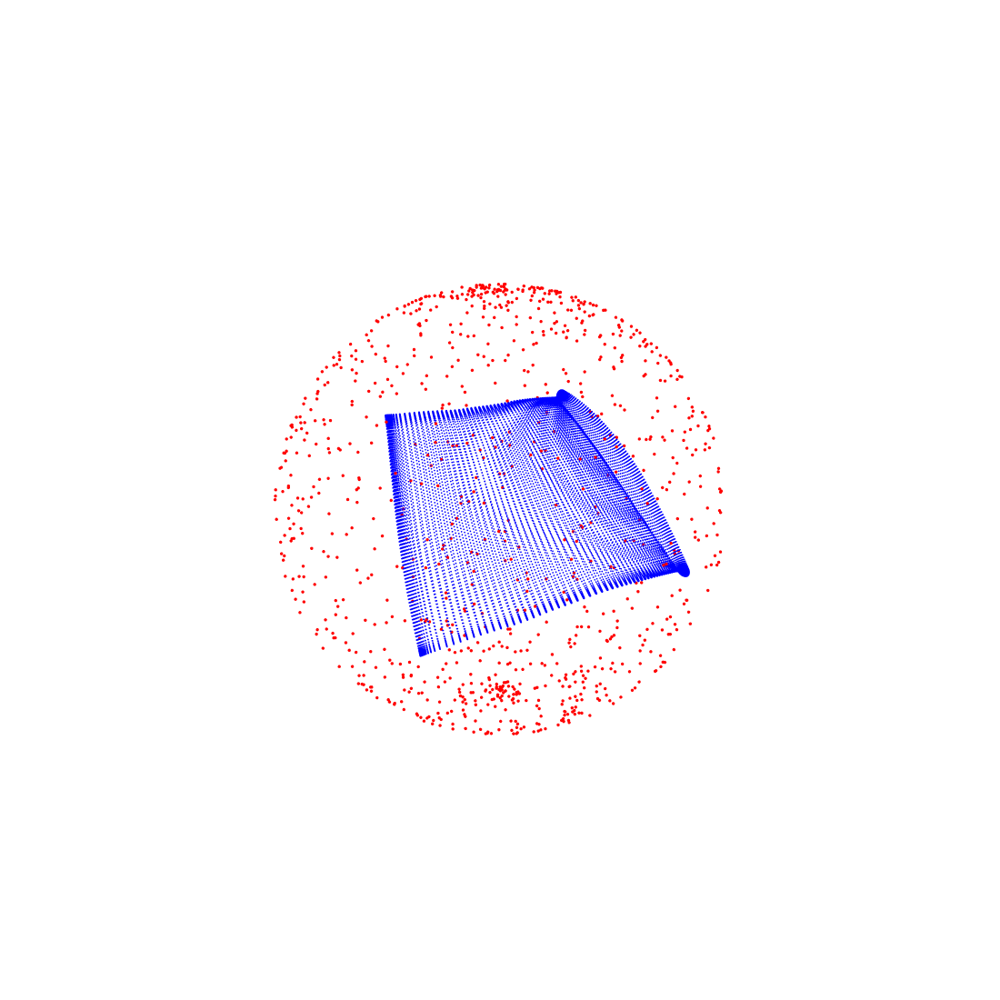

# GraduationProject

This repo contains my Master's end-of-year project, completed during my studies at ENSAI. It aims at reproducing experiments from the article "Gaussian Processes on Distributions based on Regularized Optimal Transport" and experiment on publicly available dataset.

The article is available at: [Gaussian Processes on Distributions based on Regularized Optimal Transport](https://arxiv.org/abs/2210.06574)

The first part of the project consisted of a *methododogical* part. The goal was to familiarize with the paper, the Optimal Transport theory and reproduce one of the experiment of the paper. Our written report, slides and Jupyter notebook can be found here.

The second part of the project, *experimental* part, is about applying the foundings of the paper on a real life dataset and compare the proposed method against established ones such as the Wasserstein distance.

## Main results

Our report exhibit the performance of the Sinkhorn kernel presented in the paper on the Rotor37 dataset. 